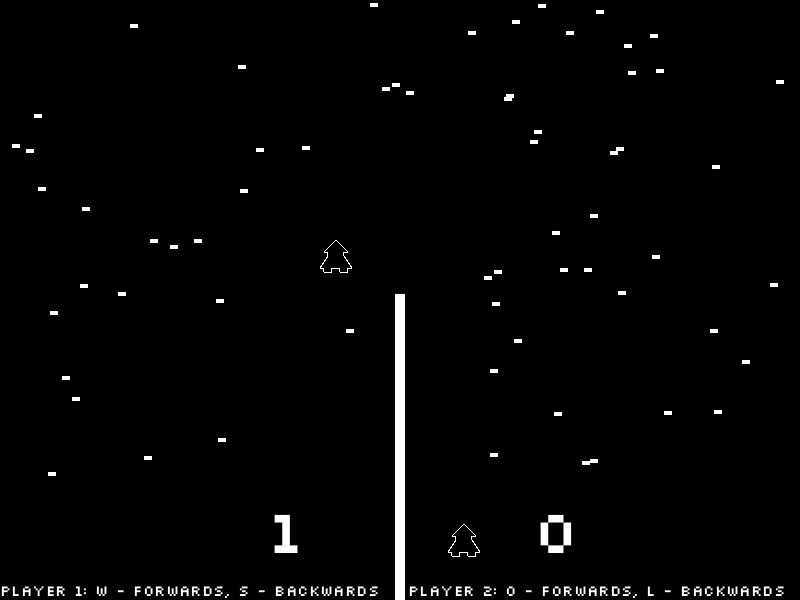

# kha-astro-race

Sources for an Astro Race (1973) arcade video game clone, written in [Haxe](http://haxe.org/) using the [Kha](http://kha.tech/) framework.

This is a 'learning repository', in a sense. Commit messages are descriptive and concern both the Kha framework and the game cloning process.

The code wasn't written in an optimal way, but it will likely be revisited in the future.
